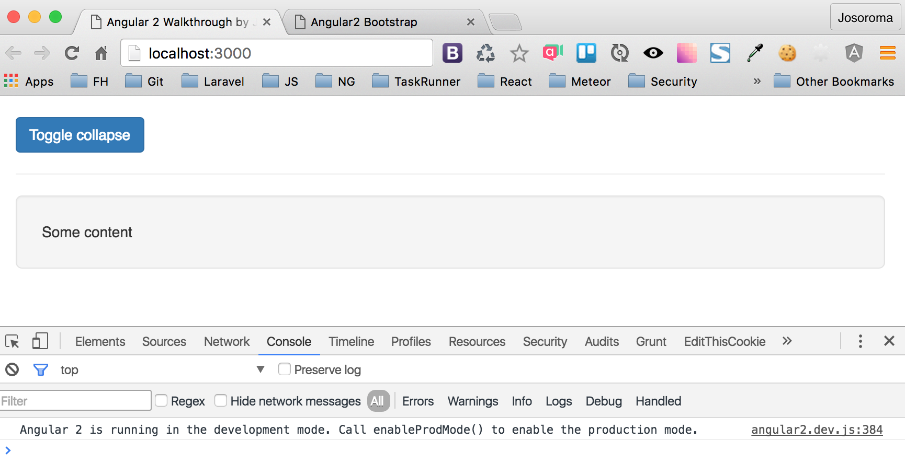

# Angular 2 Walkthrough



 - [Angular 2 Quickstart](https://github.com/angular/quickstart)

## TypeScript Config

```
{
  "compilerOptions": {
    "target": "es5",
    "module": "system",
    "moduleResolution": "node",
    "sourceMap": true,
    "emitDecoratorMetadata": true,
    "experimentalDecorators": true,
    "removeComments": false,
    "noImplicitAny": false
  },
  "exclude": [
    "node_modules",
    "typings/main",
    "typings/main.d.ts"
  ]
}
```

## TypeScript Lint Config

 - atom ng2-component/tslint.json

## Typings Config

 - atom ng2-component/typings.json

## npm install

```
npm install
```

## Start App

### Compilation, Maps and Specs

 - ng2-component/app/josoroma.app.js
 - ng2-component/app/josoroma.app.js.map
 - ng2-component/app/josoroma.app.spec.js
 - ng2-component/app/josoroma.app.spec.js.map

```
npm start
```

 - http://localhost:3000

## Unit Test

### Karma

 - [Karma Runner](https://karma-runner.github.io)

A simple tool that allows you to execute JavaScript code in multiple real browsers.

Karma is not a testing framework, nor an assertion library. Karma just launches a HTTP server, and generates the test runner HTML file we probably already know from our favourite testing framework. So for testing purposes we can use pretty much anything we like.

### Jasmine

 - [Jasmine DDT](http://jasmine.github.io/2.0/introduction.html)

Jasmine is a Behavior Driven Development testing framework for JavaScript. It does not rely on browsers, DOM, or any JavaScript framework.

```
npm test
```

 - http://localhost:9876/debug.html

### Unit Tests Output

```
chrome _test-output/tests.html
```

## Components are self-describing

A component:

 - Knows how to interact with its host element.
 - knows how to render itself.
 - Configures dependency injection.
 - Has a well-defined public API of input and output properties.

Components are fundamental building blocks of Angular 2 applications:

 - They have well-defined inputs and outputs.
 - They have well-defined lifecycle.
 - They are self-describing.

Directives, and in particular components, are the most important part of Angular 2. They are the fundamental building blocks of Angular 2 applications. They are self-describing. They describe their public API, which is inputs and outputs. They describe their private API, which is lifecycle hooks, and how they interact with the host element.

Some components will depend on other components and services. The dependency injection module will provide those. It will construct the component tree, which is the core of any Angular 2 application.

Finally, property bindings and zones is what makes Angular 2 applications interactive.

Reference: [The Core Concepts of Angular 2](http://victorsavkin.com/post/118372404541/the-core-concepts-of-angular-2).

## Native Angular2 Directives for Bootstrap

 - [ng2-bootstrap](https://github.com/valor-software/ng2-bootstrap)

```
npm install --save bootstrap

npm install --save ng2-bootstrap
```
